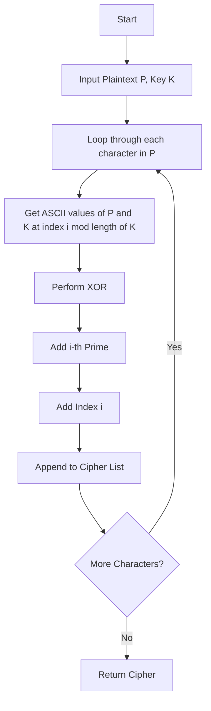
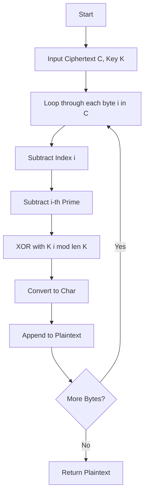

<p align="center">
  
</p>

<h3 align="center">
  Hajee Mohammad Danesh Science and Technology University,Dinajpur-5200.
</h3>
<h3 align="center">
<b></b>Project Name: CodeCraft-Smart Contest Analysis System<b></b>
</h3>

<h3 align="center">
  Course Title: Software Engineering
</h3>

<h3 align="center">
  Course Code: CSE 305
</h3>
<br>
<h1 align="center">Submitted By</h1>

 <p align="center">Sultan Mahamud Opu<br>Student ID: 2102040<br>Level: 3 Semester: I<br>Department of Computer Science and Engineering</p>
 <br>

<h1 align="center">Submitted To</h1>

 <p align="center">Pankaj Bhowmik<br>Lecturer<br>Department of Computer Science and Engineering</p>


<br><br><br>
# 🔐 SafeLock Cipher: A New Approach to Lightweight Data Encryption

A **hybrid character-level symmetric encryption algorithm** that combines:
- Bitwise **XOR** operation
- **Prime-indexed shifting**
- **ASCII offset modulation**

Designed for **educational and lightweight cryptographic applications**, SafeLock Cipher demonstrates core principles of encryption and decryption using modular arithmetic and key-based transformation.

---

## ✅ 1. Algorithm Title
**SafeLock Cipher: A New Approach to Lightweight Data Encryption**  
> _A hybrid character-level encryption scheme using bitwise XOR, prime rotation, and ASCII modulation._

---

## ✅ 2. Algorithm Design

### 📌 Basic Concept
SafeLock Cipher uses a **3-phase transformation** approach:
1. **XOR Operation**: Introduces key-based scrambling.
2. **Prime Number Shifting**: Applies position-dependent prime offsets.
3. **ASCII Offset Modulation**: Introduces further diffusion based on character index.

> 🔁 **Symmetric Key Cipher** – The same key is used for both encryption and decryption.

---

## ✅ 3. Encryption Algorithm

### 🔐 Steps to Encrypt
**Input**:  
- `Plaintext P` (string)  
- `Key K` (string)

**Process**:
1. **XOR Layer**:
   - Convert characters of `P` and `K` to ASCII codes.
   - XOR each character in `P` with the corresponding (cycled) character in `K`.

2. **Prime Shift**:
   - Add the i-th prime number to the XORed result.
   - Use modulo 256 to wrap within the byte limit.

3. **ASCII Offset Modulation**:
   - Add the current index `i` to each byte.

**Output**: List of encrypted byte values (ciphertext).

---

## ✅ 4. Decryption Algorithm

### 🔓 Steps to Decrypt
**Input**:  
- `Ciphertext C` (list of int)  
- `Key K` (string)

**Process**:
1. **Reverse ASCII Offset**:  
   Subtract index `i` from each byte.
2. **Reverse Prime Shift**:  
   Subtract i-th prime number.
3. **XOR with Key**:  
   XOR result with corresponding character of `K` (cycled) to get original ASCII.

**Output**: Decrypted string (original plaintext).

---

## ✅ 5. Example Test Case

### 🧪 Example:  
**Plaintext** = `"HELLO"`  
**Key** = `"KEY"`

| Char | ASCII | Key | K_ASCII | XOR | +Prime | +Index | Final |
|------|-------|-----|---------|-----|--------|--------|--------|
| H    | 72    | K   | 75      | 3   | +2     | +0     | 5      |
| E    | 69    | E   | 69      | 0   | +3     | +1     | 4      |
| L    | 76    | Y   | 89      | 21  | +5     | +2     | 28     |
| L    | 76    | K   | 75      | 7   | +7     | +3     | 17     |
| O    | 79    | E   | 69      | 10  | +11    | +4     | 25     |

**Encrypted Bytes (Ciphertext)**:  
`\x05 \x04 \x1C \x11 \x19` → `[5, 4, 28, 17, 25]`

### 🔓 Decryption:
- Subtract index: `[5, 3, 26, 14, 21]`
- Subtract primes: `[3, 0, 21, 7, 10]`
- XOR with key: `[72, 69, 76, 76, 79]` → `"HELLO"`

---

## ✅ 6. Pseudocode

### 🔐 Encryption
```plaintext
Input: plaintext P, key K
Output: ciphertext C

Initialize primes = first len(P) prime numbers
C = []
For i = 0 to len(P)-1:
    p_ascii = ASCII of P[i]
    k_ascii = ASCII of K[i mod len(K)]
    x = p_ascii XOR k_ascii
    x = (x + primes[i]) mod 256
    x = (x + i) mod 256
    C.append(x)
Return C
```

### 🔓 Decryption
```plaintext
Input: ciphertext C, key K
Output: plaintext P

Initialize primes = first len(C) prime numbers
P = []
For i = 0 to len(C)-1:
    x = (C[i] - i + 256) mod 256
    x = (x - primes[i] + 256) mod 256
    k_ascii = ASCII of K[i mod len(K)]
    p_ascii = x XOR k_ascii
    P.append(CHAR(p_ascii))
Return join(P)
```

---

## ✅ 7. Flowcharts

### 🔄 Encryption Flowchart



### 🔁 Decryption Flowchart



---

## ✅ 8. Python Source Code

```python
def is_prime(n):
    if n < 2: return False
    for i in range(2, int(n**0.5)+1):
        if n % i == 0: return False
    return True

def get_primes(n):
    primes = []
    i = 2
    while len(primes) < n:
        if is_prime(i): primes.append(i)
        i += 1
    return primes

def encrypt(plaintext, key):
    primes = get_primes(len(plaintext))
    cipher = []
    for i, char in enumerate(plaintext):
        p_ascii = ord(char)
        k_ascii = ord(key[i % len(key)])
        x = p_ascii ^ k_ascii
        x = (x + primes[i]) % 256
        x = (x + i) % 256
        cipher.append(x)
    return cipher

def decrypt(ciphertext, key):
    primes = get_primes(len(ciphertext))
    plain = []
    for i, val in enumerate(ciphertext):
        x = (val - i + 256) % 256
        x = (x - primes[i] + 256) % 256
        k_ascii = ord(key[i % len(key)])
        p_ascii = x ^ k_ascii
        plain.append(chr(p_ascii))
    return ''.join(plain)

# Example Test
pt = "HELLO"
key = "KEY"
ct = encrypt(pt, key)
print("Cipher:", ct)
pt2 = decrypt(ct, key)
print("Decrypted:", pt2)
```

---

## ✅ 9. Advantages & Disadvantages

### ✅ Advantages
- ✅ Simple and intuitive for beginners in cryptography
- ✅ Uses **bitwise, prime logic, and modular arithmetic**
- ✅ Harder to break with basic frequency analysis
- ✅ Symmetric cipher: Same key simplifies management
- ✅ Customizable strength with key and length

### ❌ Disadvantages
- ❌ Not resistant to advanced cryptanalysis (e.g. chosen plaintext attacks)
- ❌ Key reuse can expose XOR layer vulnerabilities
- ❌ Performance declines for very large texts due to prime generation
- ❌ Not suitable for industrial-grade security without improvements

---

## ✅ 10. Applications & Use Cases

- 🧑‍🏫 Educational demo of hybrid encryption schemes
- 🛡️ Simple protection for short sensitive messages (notes, configs)
- 🧪 Experimental design for layered encryption methods
- 🔬 Suitable for demonstrating encryption concepts in **Cryptography/Mathematics** courses
